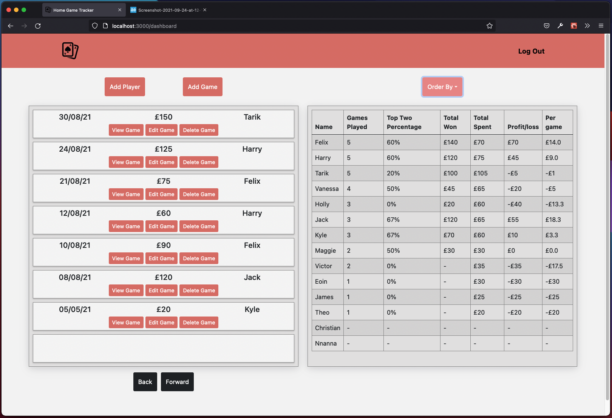
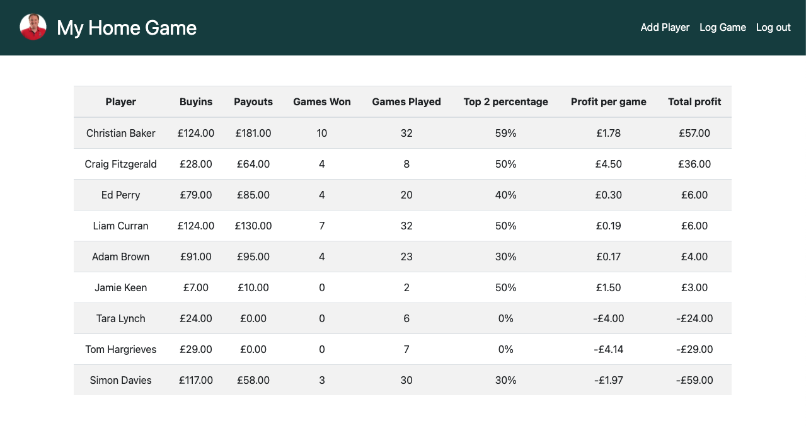
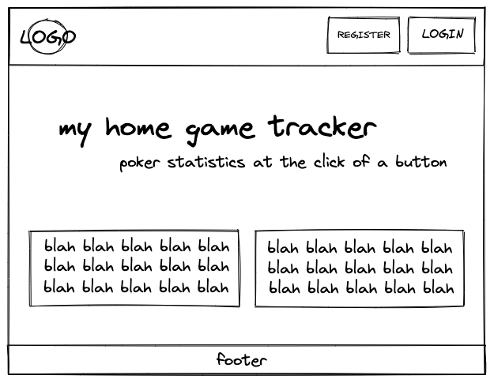
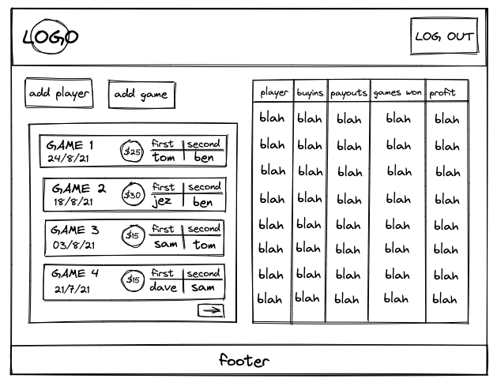
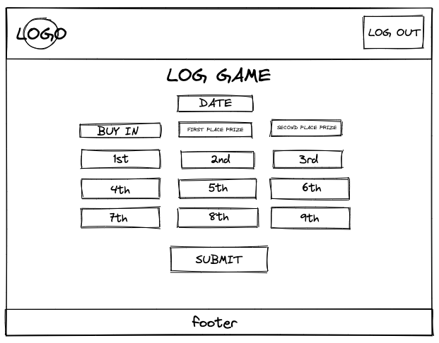
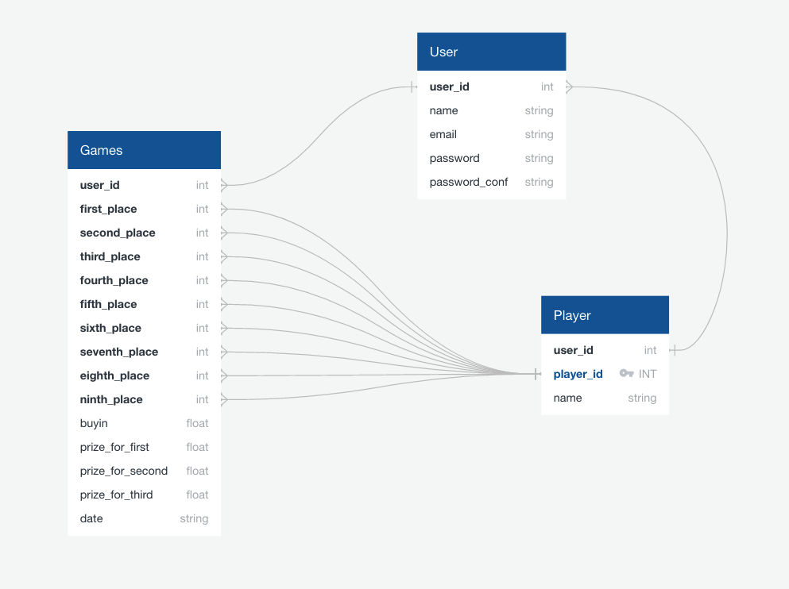
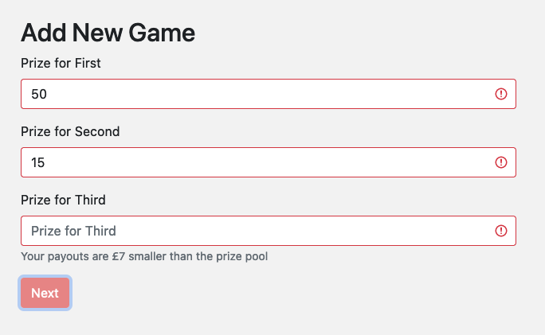

# Home Game Tracker



## Project Overview

Home Game Tracker is an application designed to solve a real-world problem - it’s a way to track online or in-person ‘home’ poker games based on a regular stable of players input by the user, which is translated into individual player statistics.

Home Game Tracker is a full-stack application, using React for the frontend, and Python and Django for the backend. It was submitted as my fourth project for General Assembly’s Software Engineering Course, 
built and delivered solo over 8 days.

You can find the project deployed using Heroku/Netlify, here.

## Brief

* Build a full-stack application by making your own backend and your own frontend
* Use a Python Django API using Django Rest Framework to serve your data from an SQL database
* Consume your API with a separate frontend built with React
* Be a complete product which most likely means multiple relationships and CRUD functionality for at least a couple of models
* *Implement thoughtful user stories/wireframes that are significant enough to help you know which features are core MVP and which you can cut
* Have a visually impressive design to kick your portfolio up a notch and have something to wow future clients and employers
* Be deployed online, so it’s publicly available


## Technologies Used
### Backend 
* Python
* Django
* Django REST Framework
* Psycopg2
* pyJWT
* Insomnia REST Client

### Frontend
* React.js
* JavaScript
* HTTP5
* SCSS
* Bootstrap-React
* Bootstrap
* Axios

## Process

This is the second iteration of this idea - the first being my final project from CS50x, an online CS course I took prior to General Assembly. The original was a Flask/Python project that served a SQLite database, but was extremely limited in functionality. I wanted to build upon this idea but apply everything I’d learnt over the previous 11 weeks.

The first iteration of the idea -


Landing page wireframe - 


Dashboard wireframe -


Log game wireframe -



This was the only project during my time at the General Assembly that I used Trello for planning and organisation. As I chose to do the project solo, it necessitated a new degree of planning and discipline to be able to ensure it all got done by the deadline. 

After wireframing, I created an Entity Relationship Diagram to sketch out the relationships between users, players and games. Users create both players and games, and games can have many players. I kept the models deliberately simple - the complexity of the project wasn’t derived from the relationships between the models, but how the data is filtered and presented on the frontend.



Once I was happy with this, I began building out my models, views and serializers using Django REST Framework. This was my first experience using Django and I found it for the most part, straightforward - although admittedly I didn’t need super complex relationships between models to provide the functionality that the project needed. Below is a snippet of code showing how I was able to set up the view for users to create games populated by players.

```python
class GameListView(APIView):

    ''' List View for /players INDEX CREATE '''
    def post(self, request):
        serialized_game = GameSerializer(data=request.data)
        if serialized_game.is_valid():
            serialized_game.save()
            return Response(serialized_game.data)
        return Response(serialized_game.errors, status=status.HTTP_422_UNPROCESSABLE_ENTITY)

    def get(self, request):
        games = Game.objects.all()
        serialized_games = PopulatedGameSerializer(games, many=True)
        return Response(serialized_games.data)

class GameDetailView(RetrieveDestroyAPIView):

    ''' Detail View for /players SHOW UPDATE DELETE'''
    queryset = Game.objects.all()
    serializer_class = PopulatedGameSerializer

    def put(self, request, pk):
        try:
            game_to_update = Game.objects.get(pk=pk)
        except Game.DoesNotExist:
            return Response(status=status.HTTP_404_NOT_FOUND)

        serialized_game = GameSerializer(game_to_update, data=request.data)
        if serialized_game.is_valid():
            serialized_game.save()
            return Response(serialized_game.data)
        return Response(serialized_game.errors, status=status.HTTP_422_UNPROCESSABLE_ENTITY)
```

Once I was satisfied with the way the backend was working, I swiftly moved to the frontend to work on the core of the app. One of the first things I did, even before basic page layouts, was to create a function that takes the names from the list of players and cross-references it with the results from the list of games. The reason why I worked on this first was because, without it, I didn’t have an application that did anything useful. 

The function maps through the list of players and creates an object for each one. Then within that map, it maps through the list of games and tracks instances of the player, with the game payout and the player positioning taken into account to tally wins and losses.

```javascript
      if (first === name) {
        firstPlaceCount += 1
        winningsCount += game.prizeForFirst
        lossesCount += game.buyIn
      } playerObj = { ...playerObj, 'first': firstPlaceCount, 
        'winnings': winningsCount, 'losses': lossesCount }
```

I then created some custom functions to work out percentages and change the formatting to correctly display minus numbers, as some of the output wasn’t entirely useful!

```javascript
export function percentage (part, whole) {
  const result = 100 * part / whole
  return `${result.toFixed(0)}%`
}

export function minusFormatting (num) {
  if (num < 0) {
    num = num * -1
    return `-£${num}`
  } else if (num === 0) {
    return '£0' 
  } else return `£${num}`
}
```

With the core functionality in place and the safety of the project assured, I created the UI for the main dashboard closely based on my wireframe.

The next big challenge was the design of my form for creating games. Games can have between 3 and 9 players and I was conscious that I didn’t want users to trawl through a large form to log a small game if they didn’t have to. I settled on using a stepped form to lessen the burden on the user and break the form down into chunks. After initially asking the user to input the number of players in the game, the rest of the form is then populated with only absolutely necessary fields using a lot of conditional rendering.

```javascript
const [payoutsKnown, setPayoutsKnown] = React.useState(false)
const [playerNumKnown, setPlayerNumKnown] = React.useState(false)
const [buyinKnown, setBuyinKnown] = React.useState(false)
```


This took me quite a while, as I wanted to provide the user with helpful and very specific error handling. For example, in setting the payout structure the form lets the player know how much money is in the pot and whether they’ve miscalculated the payouts.

```html
<Form.Text className="text-muted">
  {totalPotDifference > 0 ? `Your payouts are £${totalPotDifference} bigger than the prize pool` : `Your payouts are £${totalPotDifference * -1} smaller than the prize pool` }
</Form.Text>
```



Once I was satisfied with my form it was a matter of piecing together the rest of the application. I chose to use a modal from Bootstrap-React to display the detailed game data as I liked the idea of a simple one-page application, with as much information available in one place as possible.

## Challenges

This was my first solo project of any notable size - there were multiple challenges along the way as I was responsible for every part of the project. Lots of these things were simply dealing with something for the very first time and not having anyone to bounce ideas and solutions off.

As I tried to keep most of the application on the main dashboard as possible, this led to some issues with updated state not rendering or creating infinite loops, which I hadn’t encountered much in prior projects. I began to regret some of my design choices and had to find creative workarounds using React’s useEffect hook.

## Wins

There were a few things I didn’t quite have together in time to present my project - and I was able to go back a few days after and implement them as conceived.

On my ’Add Game’ form, you choose players to participate in games using drop-down select boxes. Whatever player you select should then be filtered out of the remaining select boxes, so that the user can’t choose the same player twice. This was eventually solved by filtering the list of players mapped to every select and checking the player ids against the state data captured from the other drop-downs. I had tried this during the project but hadn’t quite got my head around the logic - it was just too buggy. Whilst there is certainly room for less repetition in the code I was just so thrilled to figure out the solution.

```javascript
{playerList.filter(player => player.userId === userId)
.filter(player => player.id !== parseInt(formData.firstPlace) && 
player.id !== parseInt(formData.secondPlace) && player.id !== parseInt(formData.thirdPlace) && 
player.id !== parseInt(formData.fifthPlace) && player.id !== parseInt(formData.sixthPlace) && 
player.id !== parseInt(formData.seventhPlace) && player.id !== parseInt(formData.eighthPlace) 
&& player.id !== parseInt(formData.ninthPlace))
.map(player => (
<option key={player.id} value={player.id}>{player.name}</option>
))}
```


In a similar vein, I went back and improved the main leaderboard so the results are filterable by various criteria rather than just in order of player id, which was the case on project delivery day.

Based on some feedback I received, I created a history function on the main dashboard so the user can easily view up to 24 past games, rather than the original 8.

## Future Content and Improvements

* A more complex backend. Multiple users and leagues, functionality to allow users to comment on games/follow other users.
* Rather than a user populating games with players they create, I would have each user become the player themselves - being able to populate games with other users and vice versa. This is arguably more useful but exponentially increases complexity in every aspect of the app, and beyond the scope of the project. 
* Giving the user options to delete and edit players.
* A fully mobile responsive dashboard. This is something I would love to go back and change, it would just require a fundamental rethink as it’s currently optimised for desktop.


## Key Learnings

I learnt so much doing this project solo. Initially, I thought I should consider partnering up with someone, but figured poker statistics were pretty niche and didn’t want to compromise on my idea. There were times where I really struggled and would have valued someone to sanity check against, but I honestly got so much out of having to touch every part of the project myself. It improved my time management and was the only project on the course where I felt the need to plan everything using Trello - there was just too much work to keep track of on my own.
